### 資管系 三甲

#### 一、專題名稱：人機互動-資訊機器人

##### 小組成員：
* `學號1：0624023 姓名1：黃郁凱`
* 學號2：0624043 姓名2：黃暐翔
* 學號3：0624065 姓名3：吳禹均
* 學號4：0624071 姓名4：古宣鴻

#### 二、	專題需求:

1.如今社會高齡化現象越來越嚴重，許多獨居老人能透過機器人來得到幫助。

2.能夠讓使用者透過清楚簡易的操作來得到，想知道的資訊。

#### 三、	專題功能性需求:

1.	醫療功能
2.	預訂商品
3.	獲得資訊
	
#### 四、	專題非功能性需求:

1.	方便攜帶
2.	價錢實惠
3.	GUI介面字體清楚
4.	簡易操作
5.	人性化設計
6.	比手機電腦做的功能更專精
7.	使用時有語音提示

#### 五、	使用案例圖

 要改

#### 六、	使用案例重要性

申請就診-> 推撥資訊->預定商品

#### 七、	使用案例

醫療功能
1.捕捉使用者資訊
2.擷取影像中的車牌圖片
3.辨識車牌文字
4.比對資料庫
5.資料庫中有資料即通行

#### 八、	User story

* 身為一個使用者，希望機器人能讓我記錄身體狀況並提醒我就醫，讓我了解身體狀況。

* 身為一個使用者，希望機器人能讓我預訂商品、購買外送，讓我購物更便利。

* 身為一個使用者，希望機器人能讓我取得最新資訊，讓我了解各項資訊、福利。

* 身為一個企業，希望機器人能推撥商品優惠資訊，清楚顯示客戶及商品資訊，以便有效率的執行業務。

* 身為一個醫療機構，希望機器人能得知患者資料及病歷，以便看診。

* 身為一個管理者，希望機器人能讓我修改並維護資訊，以便我推播資訊。

#### 九、初步類別圖
> 身為一個使用者，希望機器人能讓我記錄身體狀況並提醒我就醫，讓我了解身體狀況。

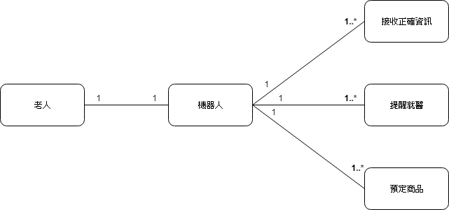

> 身為一個使用者，希望機器人能讓我預訂商品、購買外送，讓我購物更便利。

> 身為一個使用者，希望機器人能讓我取得最新資訊，讓我了解各項資訊、福利。

> 身為一個企業，希望機器人能推撥商品優惠資訊，清楚顯示客戶及商品資訊，以便有效率的執行業務。

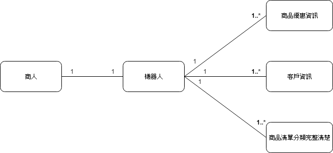

> 身為一個醫療機構，希望機器人能得知患者資料及病歷，以便看診。

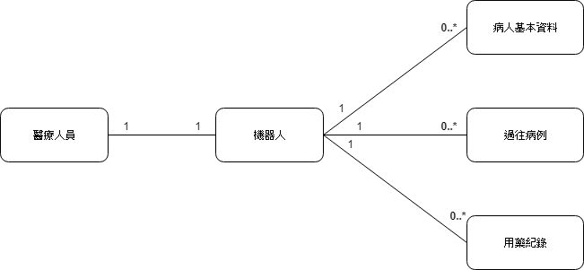

> 身為一個管理者，希望機器人能讓我修改並維護資訊，以便我推播資訊。

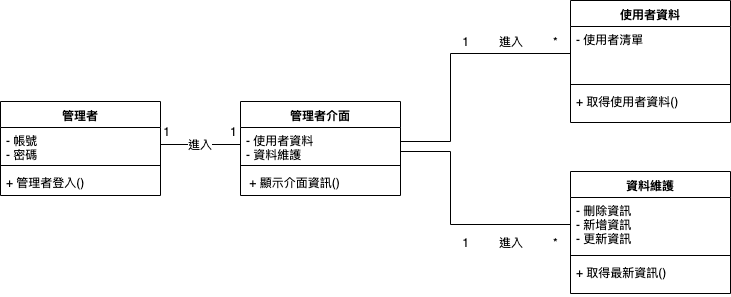

#### 十、系統循序圖

*大張的循序圖.png

* 「使用者登入醫療介面」之循序圖

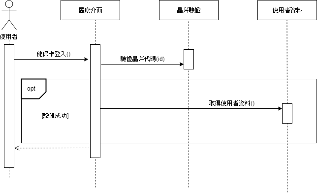

* 「使用者使用商店介面」之循序圖

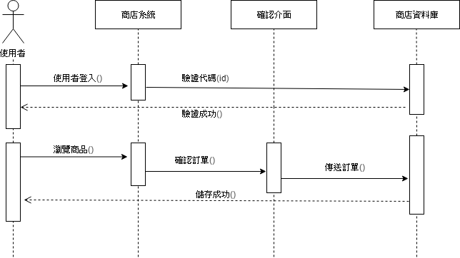

#### 十一、系統強韌圖

* 「使用者使用醫療介面」之強韌圖

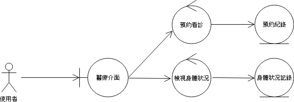

* 「使用者使用商店介面」之強韌圖

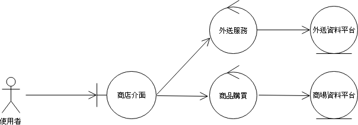

* 「使用者使用資訊介面」之強韌圖

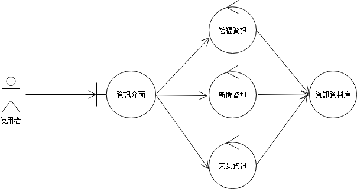

* 「管理者維護介面」之強韌圖

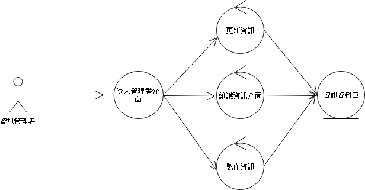

* 「整體系統」之強韌圖

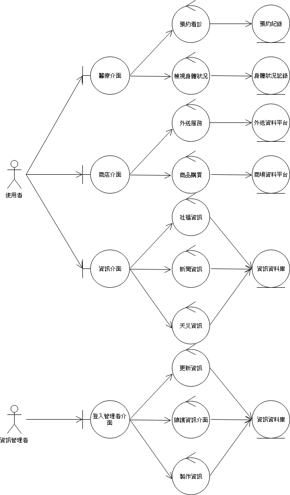   //更新跟製作要改
