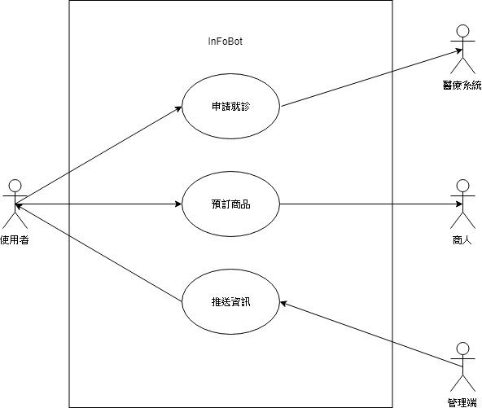
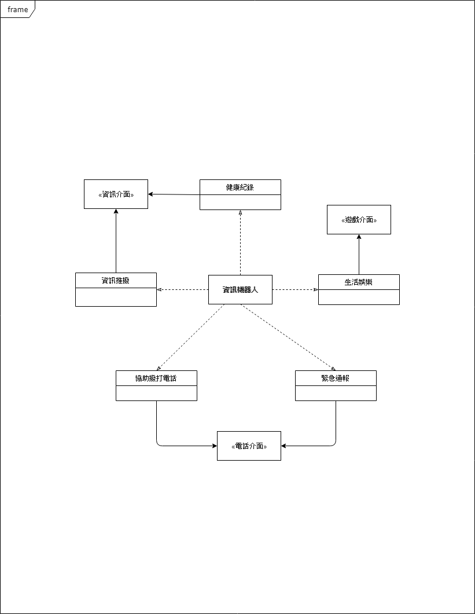

### 資管系 三甲

#### 一、專題名稱：人機互動-資訊機器人

##### 小組成員：
* `學號1：0624023 姓名1：黃郁凱`
* 學號2：0624043 姓名2：黃暐翔
* 學號3：0624065 姓名3：吳禹均
* 學號4：0624071 姓名4：古宣鴻

二、	專題需求:

1.如今社會高齡化現象越來越嚴重，許多獨居老人能透過溝通來得到幫助
2.現實中的實際操作能驅動電腦裡的程式作動

三、	專題功能性需求:

1.	隨傳隨到
2.	人性化設計
3.	比手機電腦能做到更多事
	
四、	專題非功能性需求:
1.	外觀討喜
2.	價錢實惠
3.	GUI介面字體清楚

五、	使用案例圖

六、	使用案例重要性

七、	使用案例
1.	吳爺爺在五年前的一場車禍中失去了老婆與小孩，更失去了他的雙腿，現在的他只能依靠政府救濟金過活，生活十分困苦
2.	某天吳爺爺透過社福機構得到了一台資訊機器人
3.	他透過社福人員的介紹，他只要將機器人開機，並詢問他事情
4.	這台機器人能跟他聊時事、幫助他解決生活中的疑難雜症
5.	他能透過機器人得到最新的長照資訊，當身體臨時不舒服時還能讓他及時通報最近的醫療機構，而社區的老人要辦聚會時還能通知和提醒他前往參加
6.	資訊機器人沒電時，吳爺爺只要將他接上專用充電線即可充電

八、	User story
身為一個老人，我希望他能有讓我得到最新資訊的功能，以便我不方便出門時，能知天下事。

九、初步類別圖

